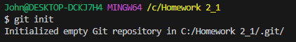
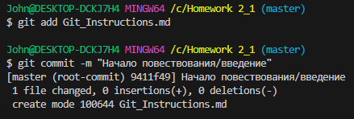
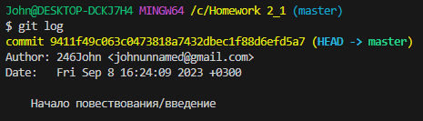
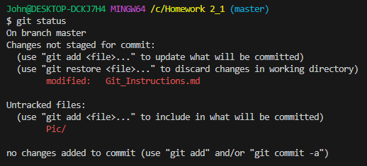
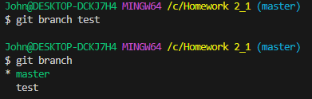
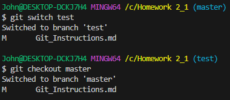
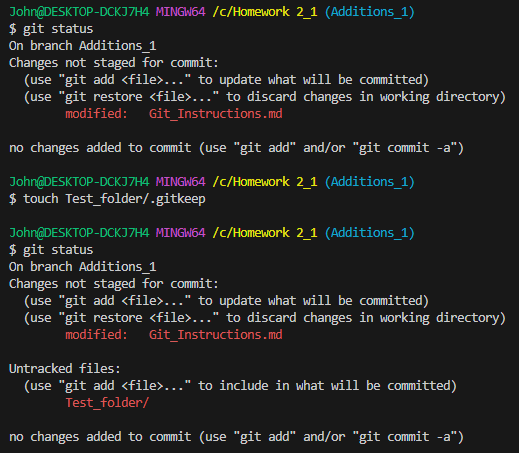
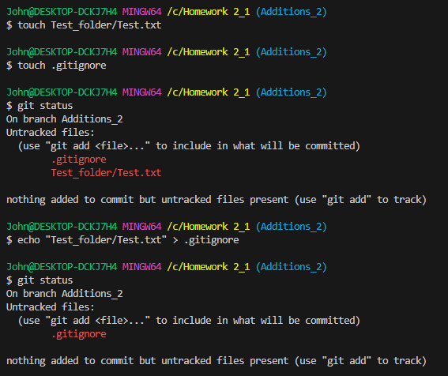

# Инструкция пользования Git

## Для начала работы необходимо создать репозиторий.

Это можно сделать командой `git init` в терминале ***(ctrl+~)***, предварительно открыв расположение будущего репозитория.

## Отслеживание файлов, сохранение, история и просмотр.

### Добавление файлов к отслеживанию.

*Для отслеживания файлов их нужно сохранять __ctrl+s__*. Используя `git add имя_файла`, добавим созданный/сохраненный файл к отслеживанию. Для создания "точки восстановления" и записи состояния файла, так же нужно использовать команду `git commit -m "имя_комментария"`, или используя аргумент *-am*, чтобы не вводить *git add*.

Если файлов много и добавить к отслеживанию необходимо все, можно использовать команду `git add .`.

Для ***удаления файла из списка подготовленных к отслеживанию*** и записи нужно воспользоваться командой `git rm --cached имя_файла`

### Просмотр ***истории изменений*** (лог).

Используя команду `git log`, можно просмотреть историю изменений и версий файлов в хронологическом порядке и с разделением по веткам.

***Компактная*** версия лога - `git log --oneline`,

***Графически оформленная*** версия лога (для упрощенного восприятия веток) - `git log --graph`,

Для ***просмотра состояния файлов*** на момент какого-либо из коммитов, используется команда `git checkout хэш_коммита`,

Для быстрого отката и возврата состояния к последнему коммиту - `git restore имя_файла`, а для сравнения изменений текущего состояния и последнего коммита - `git diff`.

***Возврат*** уже сохраненных данных ***до предыдущих "версий"*** можно осуществить с помощью команды `git reset хэш_коммита`, с аргументом *--hard* - откатится не только состояние, но и удалится сам коммит. 

## В процессе работы

### Для отслеживания ***состояния репозитория*** используется команда `git status`.

При её использовании выводится информация о том, в какой ветке находится пользователь, есть ли изменения файлов в репозитории и отслеживаются ли они.

### Для создания/тестирования функций подходят ***ветки***.

***Создание*** ветки - `git branch имя_ветки`,

***Просмотр списка*** веток - `git branch`.

***Переключение*** между ветками - `git checkout имя_ветки` *или* `git switch имя_ветки`.

***Создать и сразу перейти*** - `git checkout -b имя_ветки` *или* `git switch -c имя_ветки`.

***Удалить ветку*** - `git branch -d имя_ветки`. **Удалять ветки можно и нужно _только_ после выполнения их целевой задачи.**

***Выполнить слияние*** веток - `git merge имя_ветки`. Слияние производится ***в ту ветку, где находится пользователь***, той веткой, которая указана в команде.

Если ветка и все изменения в ней не нужны, её можно ***удалить принудительно***, используя аргумент -D: `git branch -D имя_ветки`.

## Некоторые особые случаи

Git не отслеживает пустые папки и никак не отражает их в репозитории, стоит учитывать это и знать 2 системных файла:

1. `.gitkeep`
2. `.gitignore`

Для начала ***отслеживания пустой директории*** нужно создать в ней файл *.gitkeep* (можно посредством команды touch), после чего директорию можно добавлять к отслеживанию и коммитить как обычно.

Для того, тобы дать git команду ***игнорировать*** какой-либо файл и *не вносить* его в репозиторий для отслеживания, достаточно создать файл *.gitignore* и внести в него название файла, который необходимо игнорировать.

## Работа с файловой системой.

- `ls` - отображение списка
- `ls -a` - отображение *всего* списка, включая скрытые
- `cd existing_folder` - переход
- `cd ~` - переход в корневую папку
- `cd ..` - выйти назад, "вверх"
- `cd ../..` - на 2 шага вверх
- `mkdir new_folder` - создать директорию
- `touch example.txt` - создать файл
- `echo "Text example" > Folder/File.txt` - добавить "текст"
- `cp File.txt File_Copy.txt` - копировать файл
- `mv File.txt File_2.txt` - переименовать *или переместить*, если указать путь
